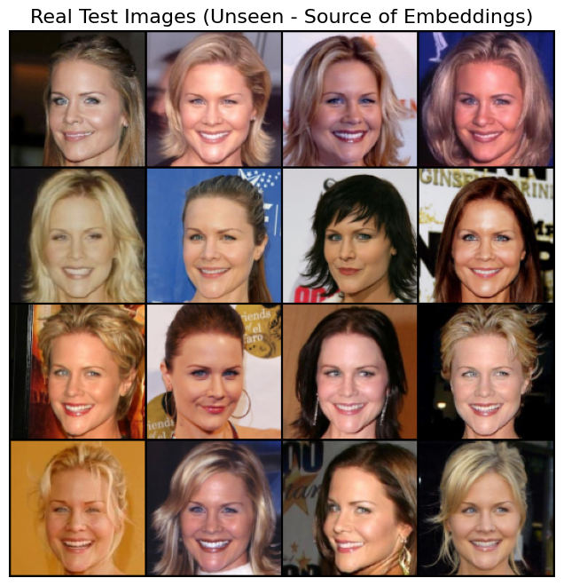
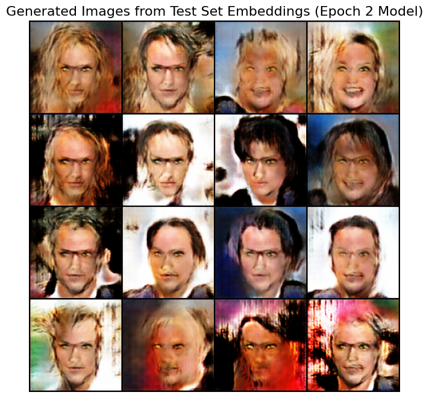

# Conditional Face Generation with Pre-trained FaceNet Embeddings

[](https://www.python.org/downloads/)
[](https://pytorch.org/)
[](https://huggingface.co/datasets)
[](https://wandb.ai)

This project demonstrates the rapid development of a high-quality conditional Generative Adversarial Network (cGAN) capable of generating human faces based on identity features. The model is conditioned on 512-dimensional facial embeddings extracted by a pre-trained FaceNet model, allowing it to generate new faces while preserving the core identity of a source image.

The primary goal was to simulate a one-day development cycle to build a production-viable model, emphasizing efficient design, robust tooling, and clear, metric-driven evaluation.

## Qualitative Results & Evaluation

The model demonstrates a strong ability to capture and reconstruct identity-specific facial features from an unseen test image. Below are examples where the model was given a real, unseen image, generated an embedding, and then produced a new face from that embedding and random noise.

<table>
  <tr align="center">
    <td><b>Real Image (Unseen Test Set)</b></td>
    <td><b>AI-Generated Face from Embedding</b></td>
  </tr>
  <tr align="center">
    <td>
      
    </td>
    <td>
      
    </td>
  </tr>
</table>

## Live Training Dashboard (Weights & Biases)

The complete training process, including all metrics, losses, and generated image samples at every checkpoint, was logged using Weights & Biases. Due to organization-level privacy settings on the W&B workspace, direct public access is restricted. I've made the runs under org

Pictures from wandb after 2 epoch training was completed are in wandb screenshots directory, the provision to make the wandb public is not there in the weights and biases workspace in which I completed this project, so I'd need to invite people in my team for them to see the results of run involved in this project. For that I would need to get the mail ids to give access and invite in the workspace and then it would be visible to them. I am open to give access to mail id, but the project workspace cannot be made public (It's written down in the W&B settings under my workspace.) Comment mail id and I'll send a invite, then it can be visible.

Wandb (Org.) - amannagrawall002-iit-roorkee-org

Wandb (username) - amannagrawall002

A video walkthrough of the interactive dashboard, showcasing the model's learning progression over two epochs, is provided below.

[**Video Walkthrough of the W&B Dashboard**](https://www.loom.com/share/786e7cd321924bc3b46da82175989113?sid=7c7c0c10-df79-489c-b9ab-e55b6709dc4a)

> For direct access to the interactive W&B run, please provide an email address for an invitation to the private workspace. Screenshots from the dashboard are also available in the `/wandb screenshots` directory.

## Design Philosophy & Model Choice

The project's success in a short timeframe is built on three core principles:

1.  **Leveraging Pre-trained Encoders:** Instead of training a GAN from pure noise, this project uses a Conditional GAN (cGAN). The key ingenuity is employing a pre-trained **FaceNet (InceptionResnetV1)** model as a fixed feature extractor. This powerful, pre-existing knowledge of facial identity is injected into the generator, dramatically accelerating training. The generator learns not just to create faces, but to create faces that match a given high-level identity vector—analogous to how language models use text embeddings. The encoder was used exclusively in evaluation mode, ensuring no further training was performed on it.

2.  **Efficient Data Handling:** The Hugging Face `datasets` library was used to stream the CelebA dataset (`flwrlabs/celeba`) directly from the hub (`streaming=True`). This production-ready approach is highly efficient, avoiding the need to download the entire ~22GB dataset locally and enabling rapid experimentation.

3.  **Modern Tooling & Compute:** The model was trained on an Apple Silicon Mac using the `mps` (Metal Performance Shaders) backend, demonstrating the feasibility of leveraging modern consumer hardware for deep learning. All metrics were logged using `wandb` for reproducibility and clear, interactive reporting.

## Model Architecture & Weights

The architecture consists of three main components, defined in `models.py`:

1.  **FaceNet Encoder (Fixed):** A pre-trained `InceptionResnetV1` model that maps a 128x128 image to a 512-dimensional embedding vector.
2.  **Generator:** A DCGAN-style architecture that takes a 100-dim noise vector concatenated with the 512-dim face embedding. It uses a series of `ConvTranspose2d` layers to upsample this combined vector into a 128x128x3 image.
3.  **Discriminator:** A conditional discriminator that receives both an image (real or fake) and the corresponding 512-dim embedding. This forces the generator to produce images that are both realistic and consistent with the conditioning identity.

The final trained Generator weights (`generator_epoch_2.pth`) are publicly available on the Hugging Face Hub:
* **Model Hub Link:** [**amannagrawall002/generator_epoch_2.pth**](https://huggingface.co/amannagrawall002/generator_epoch_2.pth/tree/main)

## Quantitative Metrics

The model was evaluated on the CelebA test set using the **Learned Perceptual Image Patch Similarity (LPIPS)** score, a metric that aligns closely with human perception of image similarity.

| Metric | Score | Notes |
| :--- | :--- | :--- |
| **LPIPS** | **0.3981** | (Lower is better) Calculated over 200 batches from the test set. |

This strong LPIPS score indicates a high perceptual similarity between the input identity and the generated face, confirming the model's effectiveness. The final training losses after two epochs were **Generator Loss: 3.7252** and **Discriminator Loss: 0.7971**.

## Setup and Usage

### 1. Environment Setup

It is recommended to create a virtual environment. Once created, install the required packages.

```bash
# Create and activate a virtual environment (e.g., venv)
python3 -m venv venv
source venv/bin/activate

# Install requirements
pip install -r requirements.txt
````

### 2\. Training

The model was trained for two epochs sequentially. To replicate the training, first run `trainEpoch1.py` for the first epoch, then run `trainEpoch2.py` which will load the epoch 1 checkpoint and continue training for the second epoch.

```bash
# Run epoch 1
python trainEpoch1.py

# Run epoch 2 (loads checkpoint from epoch 1)
python trainEpoch2.py
```

### 3\. Inference & Evaluation

The project includes two notebooks for analysis:

  * **`inference.ipynb`**: Provides code to run inference on training images and new, unseen test images.
  * **`results.ipynb`**: Contains the full code and detailed results for the quantitative evaluation on the CelebA test set.

## Training Details & Hyperparameters

  * **Compute:** Apple Silicon M-series GPU (`mps` device)
  * **Dataset:** CelebA `train` split (\~162k images), streamed
  * **Epochs:** 2
  * **Batch Size:** 64
  * **Total Training Time:** Approx. 4-5 hours
  * **Preprocessing:** Images resized and center-cropped to 128x128, normalized to `[-1, 1]`.

The following configuration was used for the final training run:

```python
config = {
    "project_name": "conditional-face-gan-pytorch",
    "num_epochs": 2,
    "batch_size": 64,
    "image_size": 128,
    "noise_dim": 100,
    "embedding_dim": 512,
    "g_lr": 0.0002,
    "d_lr": 0.0002,
    "beta1": 0.5,
    "beta2": 0.999,
    "log_interval": 25,
    "sample_interval": 100,
    "checkpoint_dir": "./checkpoints",
}
```
